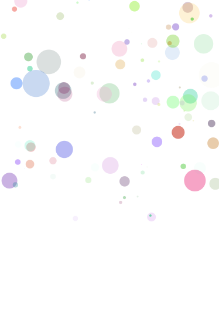
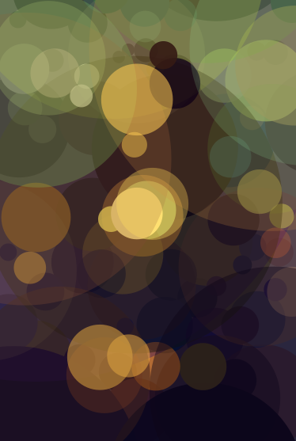

+++
title = "Evolving Art"
date = 2026-06-21
description = "There's a fun, old project to approximate the Mona Lisa with simple shapes and a genetic algorithm. Here are my notes on an implementation with circles in Python."
+++

Almost twenty years ago, Roger Johansson (or Roger Alsing) created a [fun visualization demo](https://rogerjohansson.blog/2008/12/07/genetic-programming-evolution-of-mona-lisa/) for genetic algorithms: creating the Mona Lisa with simple polygons. With a simple algorithm, he got a pretty convincing polygonal Mona Lisa

It turns out that a genetic algorithm just needs a bit of structure and a lot of time to optimize some arbitrary objective. In this case, the objective is "how much does the image look like the Mona Lisa?" Provided you define that objective in code, you can slowly get to an image that roughly looks like the painting!

# Circles

The original project used polygons, but I'll start with a basic circle.

```py
from dataclasses import dataclass

@dataclass(frozen=True)
class Circle:
    x: float
    y: float
    radius: float
    red: float
    green: float
    blue: float
    alpha: float
```

The genome is just made up of a bunch of circles.

```py
Genome = tuple[Circle, ...]
```

## Mutations

The genetic algorithm, at its most basic, operates by perturbing candidate solutions and evaluating their fitness. For the most basic version, we'll just have one candidate solution at a time, ignoring population and crossovers.

```py
from dataclasses import replace

import numpy as np


def random_circle(rng: np.random.Generator) -> Circle:
    return Circle(
        x=rng.uniform(0, 1),
        y=rng.uniform(0, 1),
        radius=0.1 * rng.beta(1, 5),
        red=rng.uniform(0, 1),
        green=rng.uniform(0, 1),
        blue=rng.uniform(0, 1),
        alpha=rng.beta(2, 5),
    )

def mutate_circle(circle: Circle, rng: np.random.Generator) -> Circle:
    mutation = float(rng.normal(0, 0.3))
    match rng.choice(7):
        case 0:  # x
            return replace(circle, x=circle.x + mutation)
        case 1:  # y
            return replace(circle, y=circle.y + mutation)
        case 2:  # radius
            radius = circle.radius + mutation
            return replace(circle, radius=max(0, radius))
        case 3:  # red
            red = min(1, max(0, circle.red + mutation))
            return replace(circle, red=red)
        case 4:  # green
            green = min(1, max(0, circle.green + mutation))
            return replace(circle, green=green)
        case 5:  # blue
            blue = min(1, max(0, circle.blue + mutation))
            return replace(circle, blue=blue)
        case 6:  # alpha
            alpha = min(1, max(0, circle.alpha + mutation))
            return replace(circle, alpha=alpha)

def mutate_genome(genome: Genome, rng: np.random.Generator) -> Genome:
    next_genome = list(genome)
    index = rng.choice(len(genome))
    if rng.uniform() < 0.9:
        next_genome[index] = mutate_circle(genome[index], rng)
    else:
        next_genome[index] = random_circle(rng)
    return tuple(next_genome)
```

The `mutate_genome` function will let the algorithm slowly explore the space of circles.

# Image Rendering

I used [`pycairo`](https://pycairo.readthedocs.io/en/latest/), a set of Python bindings to [cairo](https://cairographics.org), for image rendering. Crucially, `pycairo` lets me access the image as a NumPy array, so we can compute error metrics with simple NumPy operations.

## Surfaces

The base image representation we'll use is the [`ImageSurface`](https://pycairo.readthedocs.io/en/latest/reference/surfaces.html#class-imagesurface-surface), which can load images, draw our circles, and expose its data as a NumPy array.

We can load them from a PNG, which is how we'll get our target: the Mona Lisa.
```py
import cairo

target = cairo.ImageSurface.create_from_png("mona_lisa.png")
```

### Getting NumPy Arrays from Surfaces

Now that we have our target surface, we'll need to access that data as a NumPy array to calculate our objective function. Fortunately, it's pretty easy with `pycairo`: we just create a NumPy array buffered by the surface's data.

```py
width = target.get_width()
height = target.get_height()

target_data = np.ndarray(
    (height, width, 4),
    dtype=np.uint8,
    buffer=target.get_data(),
)
```

Note that we have to specify the shape of the data. The first two dimensions, height and width, are just the dimensions of the image. The last dimension, four, is the four bytes representing the pixel: red, green, blue, and alpha. You might also have to worry about the stride and byte padding if you're unlucky with your image.

### Creating Surfaces from NumPy Arrays

We'll also want an in-memory image surface on which we'll draw circles. Instead of loading one, we'll go in the opposite direction, creating an array then basing the image off of it.

```py
buffer_data = np.zeros_like(target_data)
surface = cairo.ImageSurface.create_for_data(
    buffer_data, target.get_format(), width, height
)
```


We can now use `buffer_data` and `target_data` as two vectors and just minimize the difference between them, with any error metric you like. Turns out, it's pretty simple to answer "does this picture look like the Mona Lisa?" using the L1 norm.

```py
error = np.abs(buffer_data.astype(float) - target_data.astype(float)).mean()
```

### Saving Images

The last thing you'll want to do with a surface is save it to a PNG. When you have a good circle Mona Lisa, you can use [`write_to_png`](https://pycairo.readthedocs.io/en/latest/reference/surfaces.html#cairo.Surface.write_to_png) to see it yourself.

## Contexts

We'll need to be able to render the circles on the image, which we'll do with a [`Context`](https://pycairo.readthedocs.io/en/latest/reference/context.html#cairo-context). You can just make the context right with the surface.

```py
ctx = cairo.Context(surface)
```

I'd recommend scaling the image so the space is easier to explore, but you can also just let the algorithm run longer.

```py
scale = min(width, height)
ctx.scale(scale, scale)
```

Either way, you now have a context, so here's a method that draws the circles to a context.

```py
import math


def render_genome(genome: Genome, ctx: cairo.Context):
    ctx.set_source_rgba(1, 1, 1, 1)
    ctx.paint()

    for circle in genome:
        ctx.save()
        ctx.translate(circle.x, circle.y)
        ctx.arc(0, 0, circle.radius, 0, 2 * math.pi)
        ctx.restore()
        ctx.set_source_rgba(circle.red, circle.green, circle.blue, circle.alpha)
        ctx.fill()
```

# Putting it All Together

For the most basic genetic algorithm of all time, we'll just make a step, see if it does better, then keep it if it works.

```py
from pathlib import Path

output = Path("output")
output.mkdir(exist_ok=True)

rng = np.random.default_rng(0)
best = tuple(random_circle(rng) for _ in range(100))

render_genome(best, ctx)
surface.flush()
best_error = np.abs(buffer_data.astype(float) - target_data.astype(float)).mean()

for step in range(1, 1_000_000):
    genome = mutate_genome(best, rng)

    render_genome(genome, ctx)
    surface.flush()
    error = np.abs(buffer_data.astype(float) - target_data.astype(float)).mean()

    if error < best_error:
        best = genome
        best_error = error

        surface.write_to_png(output / f"gen_{step}.png")
```

Running this should _very slowly_ generate circles that increasingly look like the Mona Lisa.

Your first generations will all look like polkadots. All the dots are at the top of the image, since we initialized them in a square. We'll need a lot of generations to explore moving them, resizing them, and recoloring them.



After enough time, you'll see the circles start to look more and more like the painting! Now 100 circles won't do as well as arbitrary polygons, but if you squint, you can recognize a blurry Mona Lisa.


